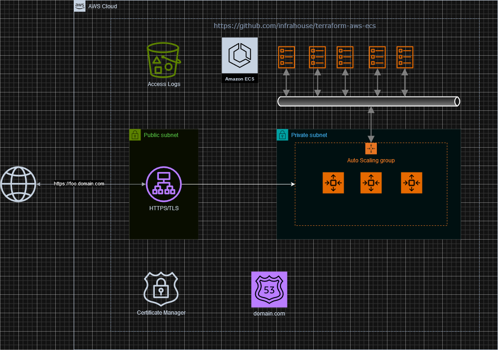

# terraform-aws-ecs
The module creates an Elastic Container Service and runs one docker image in it.



A user is expected to create a VPC, subnets 
(See the [service network](https://github.com/infrahouse/terraform-aws-service-network) module if you need to do it),
and a Route53 zone.

The module uses the [infrahouse/website-pod/aws](https://registry.terraform.io/modules/infrahouse/website-pod/aws/latest)
module to create a load balancer, autoscaling group, and update DNS.

## Usage

Basically, you need to pass the docker image and subnets where to place a load balancer 
and autoscaling group.

The module will create an SSL certificate and a DNS record. If the `dns_names` is `["www"]` 
and the zone is "domain.com", the module will create a record "www.domain.com". 
You can specify more than one DNS name, then the module will create DNS records for all of them 
and the certificate will list them as aliases. You can also specify an empty name - `dns_names = ["", "www"]` - 
if you want a popular setup https://domain.com + https://www.domain.com/.

For usage see how the module is used in the using tests in `test_data/test_module`.

```hcl
module "httpd" {
  source  = "infrahouse/ecs/aws"
  version = "3.6.1"
  providers = {
    aws     = aws
    aws.dns = aws
  }
  load_balancer_subnets         = module.service-network.subnet_public_ids
  asg_subnets                   = module.service-network.subnet_private_ids
  dns_names                     = ["foo-ecs"]
  docker_image                  = "httpd"
  container_port                = 80
  service_name                  = var.service_name
  ssh_key_name                  = aws_key_pair.test.key_name
  zone_id                       = data.aws_route53_zone.cicd.zone_id
  internet_gateway_id           = module.service-network.internet_gateway_id
}
```

### Mount EFS volume

The module can attach one or more EFS volumes to a container.

To do that, create the EFS volume with a mount point:
```hcl
resource "aws_efs_file_system" "my-volume" {
  creation_token = "my-volume"
  tags = {
    Name = "my-volume"
  }
}

resource "aws_efs_mount_target" "my-volume" {
  for_each       = toset(var.subnet_private_ids)
  file_system_id = aws_efs_file_system.my-volume.id
  subnet_id      = each.key
}
```

Pass the volumes to the ECS module:
```hcl
module "httpd" {
  source  = "infrahouse/ecs/aws"
  version = "3.6.1"
  providers = {
    aws     = aws
    aws.dns = aws
  }
...
  task_volumes = {
    "my-volume" : {
      file_system_id : aws_efs_file_system.my-volume.id
      container_path : "/mnt/"
    }
}
```
## Requirements

| Name | Version |
|------|---------|
| <a name="requirement_terraform"></a> [terraform](#requirement\_terraform) | ~> 1.5 |
| <a name="requirement_aws"></a> [aws](#requirement\_aws) | ~> 5.56 |
| <a name="requirement_cloudinit"></a> [cloudinit](#requirement\_cloudinit) | ~> 2.3 |

## Providers

| Name | Version |
|------|---------|
| <a name="provider_aws"></a> [aws](#provider\_aws) | 5.65.0 |
| <a name="provider_cloudinit"></a> [cloudinit](#provider\_cloudinit) | 2.3.4 |

## Modules

| Name | Source | Version |
|------|--------|---------|
| <a name="module_pod"></a> [pod](#module\_pod) | registry.infrahouse.com/infrahouse/website-pod/aws | 3.4.0 |

## Resources

| Name | Type |
|------|------|
| [aws_appautoscaling_policy.ecs_policy](https://registry.terraform.io/providers/hashicorp/aws/latest/docs/resources/appautoscaling_policy) | resource |
| [aws_appautoscaling_target.ecs_target](https://registry.terraform.io/providers/hashicorp/aws/latest/docs/resources/appautoscaling_target) | resource |
| [aws_ecs_capacity_provider.ecs](https://registry.terraform.io/providers/hashicorp/aws/latest/docs/resources/ecs_capacity_provider) | resource |
| [aws_ecs_cluster.ecs](https://registry.terraform.io/providers/hashicorp/aws/latest/docs/resources/ecs_cluster) | resource |
| [aws_ecs_cluster_capacity_providers.ecs](https://registry.terraform.io/providers/hashicorp/aws/latest/docs/resources/ecs_cluster_capacity_providers) | resource |
| [aws_ecs_service.ecs](https://registry.terraform.io/providers/hashicorp/aws/latest/docs/resources/ecs_service) | resource |
| [aws_ecs_task_definition.ecs](https://registry.terraform.io/providers/hashicorp/aws/latest/docs/resources/ecs_task_definition) | resource |
| [aws_iam_role.ecs_task_execution_role](https://registry.terraform.io/providers/hashicorp/aws/latest/docs/resources/iam_role) | resource |
| [aws_iam_role_policy_attachment.ecs_task_execution_role_policy](https://registry.terraform.io/providers/hashicorp/aws/latest/docs/resources/iam_role_policy_attachment) | resource |
| [aws_ami.ecs](https://registry.terraform.io/providers/hashicorp/aws/latest/docs/data-sources/ami) | data source |
| [aws_caller_identity.current](https://registry.terraform.io/providers/hashicorp/aws/latest/docs/data-sources/caller_identity) | data source |
| [aws_ec2_instance_type.ecs](https://registry.terraform.io/providers/hashicorp/aws/latest/docs/data-sources/ec2_instance_type) | data source |
| [aws_iam_policy.ecs-task-execution-role-policy](https://registry.terraform.io/providers/hashicorp/aws/latest/docs/data-sources/iam_policy) | data source |
| [aws_iam_policy_document.assume_role_policy](https://registry.terraform.io/providers/hashicorp/aws/latest/docs/data-sources/iam_policy_document) | data source |
| [aws_iam_policy_document.instance_policy](https://registry.terraform.io/providers/hashicorp/aws/latest/docs/data-sources/iam_policy_document) | data source |
| [aws_key_pair.ssh_key_pair](https://registry.terraform.io/providers/hashicorp/aws/latest/docs/data-sources/key_pair) | data source |
| [aws_region.current](https://registry.terraform.io/providers/hashicorp/aws/latest/docs/data-sources/region) | data source |
| [aws_subnet.selected](https://registry.terraform.io/providers/hashicorp/aws/latest/docs/data-sources/subnet) | data source |
| [cloudinit_config.ecs](https://registry.terraform.io/providers/hashicorp/cloudinit/latest/docs/data-sources/config) | data source |

## Inputs

| Name | Description | Type | Default | Required |
|------|-------------|------|---------|:--------:|
| <a name="input_alb_access_log_force_destroy"></a> [alb\_access\_log\_force\_destroy](#input\_alb\_access\_log\_force\_destroy) | Destroy S3 bucket with access logs even if non-empty | `bool` | `false` | no |
| <a name="input_alb_healthcheck_interval"></a> [alb\_healthcheck\_interval](#input\_alb\_healthcheck\_interval) | Number of seconds between checks | `number` | `5` | no |
| <a name="input_alb_healthcheck_path"></a> [alb\_healthcheck\_path](#input\_alb\_healthcheck\_path) | Path on the webserver that the elb will check to determine whether the instance is healthy or not. | `string` | `"/index.html"` | no |
| <a name="input_alb_healthcheck_response_code_matcher"></a> [alb\_healthcheck\_response\_code\_matcher](#input\_alb\_healthcheck\_response\_code\_matcher) | Range of http return codes that can match | `string` | `"200-299"` | no |
| <a name="input_alb_idle_timeout"></a> [alb\_idle\_timeout](#input\_alb\_idle\_timeout) | The time in seconds that the connection is allowed to be idle. | `number` | `60` | no |
| <a name="input_ami_id"></a> [ami\_id](#input\_ami\_id) | Image for host EC2 instances. If not specified, the latest Amazon image will be used. | `string` | `null` | no |
| <a name="input_asg_health_check_grace_period"></a> [asg\_health\_check\_grace\_period](#input\_asg\_health\_check\_grace\_period) | ASG will wait up to this number of seconds for instance to become healthy | `number` | `300` | no |
| <a name="input_asg_instance_type"></a> [asg\_instance\_type](#input\_asg\_instance\_type) | EC2 instances type | `string` | `"t3.micro"` | no |
| <a name="input_asg_max_size"></a> [asg\_max\_size](#input\_asg\_max\_size) | Maximum number of instances in ASG. | `number` | `10` | no |
| <a name="input_asg_min_size"></a> [asg\_min\_size](#input\_asg\_min\_size) | Minimum number of instances in ASG. | `number` | `2` | no |
| <a name="input_asg_subnets"></a> [asg\_subnets](#input\_asg\_subnets) | Auto Scaling Group Subnets. | `list(string)` | n/a | yes |
| <a name="input_assume_dns"></a> [assume\_dns](#input\_assume\_dns) | If True, create DNS records provided by var.dns\_a\_records. | `bool` | `true` | no |
| <a name="input_autoscaling_metric"></a> [autoscaling\_metric](#input\_autoscaling\_metric) | Metric to base autoscaling on. Can be ECSServiceAverageCPUUtilization, ECSServiceAverageMemoryUtilization, ALBRequestCountPerTarget | `string` | `"ECSServiceAverageCPUUtilization"` | no |
| <a name="input_autoscaling_target"></a> [autoscaling\_target](#input\_autoscaling\_target) | Target value for autoscaling\_metric. | `number` | `null` | no |
| <a name="input_autoscaling_target_cpu_usage"></a> [autoscaling\_target\_cpu\_usage](#input\_autoscaling\_target\_cpu\_usage) | If autoscaling\_metric is ECSServiceAverageCPUUtilization, how much CPU an ECS service aims to use. | `number` | `80` | no |
| <a name="input_container_command"></a> [container\_command](#input\_container\_command) | If specified, use this list of strings as a docker command. | `list(string)` | `null` | no |
| <a name="input_container_cpu"></a> [container\_cpu](#input\_container\_cpu) | Number of CPU units that a container is going to use. | `number` | `200` | no |
| <a name="input_container_healthcheck_command"></a> [container\_healthcheck\_command](#input\_container\_healthcheck\_command) | A shell command that a container runs to check if it's healthy. Exit code 0 means healthy, non-zero - unhealthy. | `string` | `"curl -f http://localhost/ || exit 1"` | no |
| <a name="input_container_memory"></a> [container\_memory](#input\_container\_memory) | Amount of RAM in megabytes the container is going to use. | `number` | `128` | no |
| <a name="input_container_port"></a> [container\_port](#input\_container\_port) | TCP port that a container serves client requests on. | `number` | `8080` | no |
| <a name="input_dns_names"></a> [dns\_names](#input\_dns\_names) | List of hostnames the module will create in var.zone\_id. | `list(string)` | n/a | yes |
| <a name="input_dockerSecurityOptions"></a> [dockerSecurityOptions](#input\_dockerSecurityOptions) | A list of strings to provide custom configuration for multiple security systems. Supported prefixes are 'label:', 'apparmor:', and 'credentialspec:' or you can specify 'no-new-privileges' | `list(string)` | `null` | no |
| <a name="input_docker_image"></a> [docker\_image](#input\_docker\_image) | A container image that will run the service. | `string` | n/a | yes |
| <a name="input_environment"></a> [environment](#input\_environment) | Name of environment. | `string` | `"development"` | no |
| <a name="input_extra_files"></a> [extra\_files](#input\_extra\_files) | Additional files to create on a host EC2 instance. | <pre>list(object({<br>    content     = string<br>    path        = string<br>    permissions = string<br>  }))</pre> | `[]` | no |
| <a name="input_internet_gateway_id"></a> [internet\_gateway\_id](#input\_internet\_gateway\_id) | Internet gateway id. Usually created by 'infrahouse/service-network/aws' | `string` | n/a | yes |
| <a name="input_load_balancer_subnets"></a> [load\_balancer\_subnets](#input\_load\_balancer\_subnets) | Load Balancer Subnets. | `list(string)` | n/a | yes |
| <a name="input_managed_draining"></a> [managed\_draining](#input\_managed\_draining) | Enables or disables a graceful shutdown of instances without disturbing workloads. | `bool` | `true` | no |
| <a name="input_managed_termination_protection"></a> [managed\_termination\_protection](#input\_managed\_termination\_protection) | Enables or disables container-aware termination of instances in the auto scaling group when scale-in happens. | `bool` | `true` | no |
| <a name="input_root_volume_size"></a> [root\_volume\_size](#input\_root\_volume\_size) | Root volume size in EC2 instance in Gigabytes | `number` | `30` | no |
| <a name="input_service_health_check_grace_period_seconds"></a> [service\_health\_check\_grace\_period\_seconds](#input\_service\_health\_check\_grace\_period\_seconds) | Seconds to ignore failing load balancer health checks on newly instantiated tasks to prevent premature shutdown, up to 2147483647. | `number` | `null` | no |
| <a name="input_service_name"></a> [service\_name](#input\_service\_name) | Service name. | `string` | n/a | yes |
| <a name="input_ssh_cidr_block"></a> [ssh\_cidr\_block](#input\_ssh\_cidr\_block) | CIDR range that is allowed to SSH into the backend instances | `string` | `null` | no |
| <a name="input_ssh_key_name"></a> [ssh\_key\_name](#input\_ssh\_key\_name) | ssh key name installed in ECS host instances. | `string` | n/a | yes |
| <a name="input_task_desired_count"></a> [task\_desired\_count](#input\_task\_desired\_count) | Number of containers the ECS service will maintain. | `number` | `1` | no |
| <a name="input_task_efs_volumes"></a> [task\_efs\_volumes](#input\_task\_efs\_volumes) | Map name->{file\_system\_id, container\_path} of EFS volumes defined in task and available for containers to mount. | <pre>map(<br>    object(<br>      {<br>        file_system_id : string<br>        container_path : string<br>      }<br>    )<br>  )</pre> | `{}` | no |
| <a name="input_task_environment_variables"></a> [task\_environment\_variables](#input\_task\_environment\_variables) | Environment variables passed down to a task. | <pre>list(<br>    object(<br>      {<br>        name : string<br>        value : string<br>      }<br>    )<br>  )</pre> | `[]` | no |
| <a name="input_task_ipc_mode"></a> [task\_ipc\_mode](#input\_task\_ipc\_mode) | The IPC resource namespace to use for the containers in the task. See https://docs.aws.amazon.com/AmazonECS/latest/APIReference/API_TaskDefinition.html | `string` | `null` | no |
| <a name="input_task_local_volumes"></a> [task\_local\_volumes](#input\_task\_local\_volumes) | Map name->{host\_path, container\_path} of local volumes defined in task and available for containers to mount. | <pre>map(<br>    object(<br>      {<br>        host_path : string<br>        container_path : string<br>      }<br>    )<br>  )</pre> | `{}` | no |
| <a name="input_task_max_count"></a> [task\_max\_count](#input\_task\_max\_count) | Highest number of tasks to run | `number` | `10` | no |
| <a name="input_task_min_count"></a> [task\_min\_count](#input\_task\_min\_count) | Lowest number of tasks to run | `number` | `1` | no |
| <a name="input_task_role_arn"></a> [task\_role\_arn](#input\_task\_role\_arn) | Task Role ARN. The role will be assumed by a container. | `string` | `null` | no |
| <a name="input_users"></a> [users](#input\_users) | A list of maps with user definitions according to the cloud-init format | `any` | `null` | no |
| <a name="input_zone_id"></a> [zone\_id](#input\_zone\_id) | Zone where DNS records will be created for the service and certificate validation. | `string` | n/a | yes |

## Outputs

| Name | Description |
|------|-------------|
| <a name="output_asg_arn"></a> [asg\_arn](#output\_asg\_arn) | Autoscaling group ARN created for the ECS service. |
| <a name="output_asg_name"></a> [asg\_name](#output\_asg\_name) | Autoscaling group name created for the ECS service. |
| <a name="output_load_balancer_dns_name"></a> [load\_balancer\_dns\_name](#output\_load\_balancer\_dns\_name) | Load balancer DNS name. |
| <a name="output_service_arn"></a> [service\_arn](#output\_service\_arn) | ECS service ARN. |
