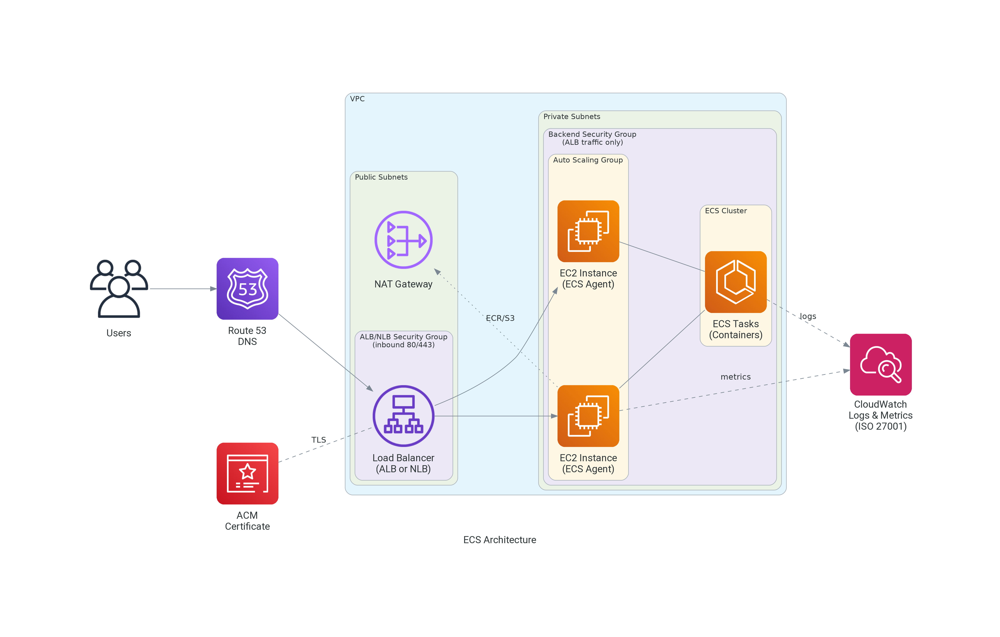

# terraform-aws-ecs

A Terraform module that creates an Amazon ECS cluster with EC2 capacity providers
and runs containerized services with automatic scaling, load balancing, and monitoring.

## Features

- **ECS Cluster with EC2 Capacity Provider** - Managed Auto Scaling Group with automatic
  capacity management
- **Application Load Balancer (ALB)** or **Network Load Balancer (NLB)** - Configurable
  load balancer type with SSL/TLS termination
- **Automatic SSL Certificates** - ACM certificate creation and DNS validation
- **Auto Scaling** - Task-level scaling based on CPU, memory, or request count metrics
- **CloudWatch Integration** - Container and EC2 instance logging with configurable retention
- **CloudWatch Alarms** - Health monitoring with email notifications
- **EFS Volume Support** - Mount persistent storage to containers with encryption in transit
- **Spot Instance Support** - Cost optimization with on-demand base capacity
- **Extra Target Groups** - Expose multiple container ports through the same load balancer

## Quick Start

> **Note:** Check the [Terraform Registry](https://registry.terraform.io/modules/infrahouse/ecs/aws/latest)
> or [GitHub Releases](https://github.com/infrahouse/terraform-aws-ecs/releases) for the latest version.

```hcl
module "ecs_service" {
  source  = "registry.infrahouse.com/infrahouse/ecs/aws"
  version = "7.6.0"

  providers = {
    aws     = aws
    aws.dns = aws
  }

  # Required parameters
  service_name          = "my-api"
  docker_image          = "nginx:latest"
  container_port        = 80
  alarm_emails          = ["devops@example.com"]

  # Networking
  load_balancer_subnets = module.vpc.public_subnet_ids
  asg_subnets           = module.vpc.private_subnet_ids
  zone_id               = data.aws_route53_zone.main.zone_id
  dns_names             = ["api"]

  # Optional: Override defaults
  environment           = "production"
  asg_instance_type     = "t3.small"
  task_desired_count    = 2
}
```

This creates:

- An ECS cluster named `my-api`
- An ALB with SSL certificate for `api.yourdomain.com`
- Auto Scaling Group with EC2 instances
- CloudWatch log groups and alarms
- DNS records pointing to the load balancer

## Architecture



The module creates:

1. **ECS Cluster** - Container orchestration with EC2 capacity provider
2. **Auto Scaling Group** - EC2 instances running the ECS agent
3. **Load Balancer** - ALB or NLB distributing traffic to containers
4. **Task Definition** - Container configuration with resource limits
5. **ECS Service** - Maintains desired task count with rolling deployments
6. **CloudWatch** - Logging and monitoring with alerting

## Requirements

| Name | Version |
|------|---------|
| terraform | ~> 1.5 |
| aws | >= 5.56, < 7.0 |

## Next Steps

- [Getting Started](getting-started.md) - Prerequisites and first deployment
- [Configuration](configuration.md) - All variables explained with examples
- [Troubleshooting](troubleshooting.md) - Common issues and solutions
